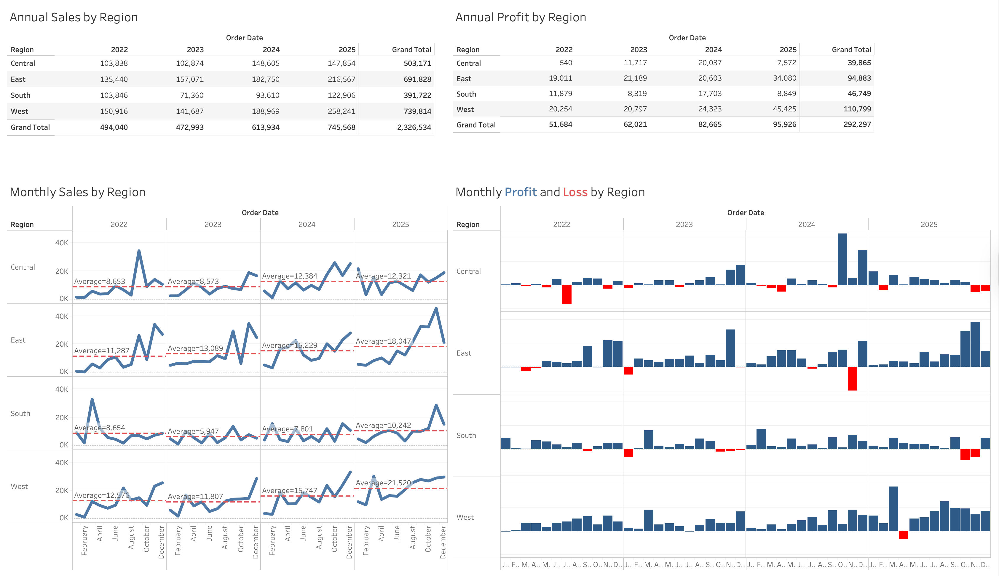

## Overview

In-Class Exercise 2 is a continuation of In-Class Exercise 1, where we used the Superstore dataset to build a sales and profit dashboard in Tableau Public.

The dashboard visualises annual and monthly sales and profit by region from 2022 to 2025.

## Dashboard

The interactive dashboard can be viewed on Tableau Public at the link below:

👉 [View Dashboard on Tableau Public](https://public.tableau.com/app/profile/carina.peh/viz/TableauInClassExercise2/Dashboard1)

