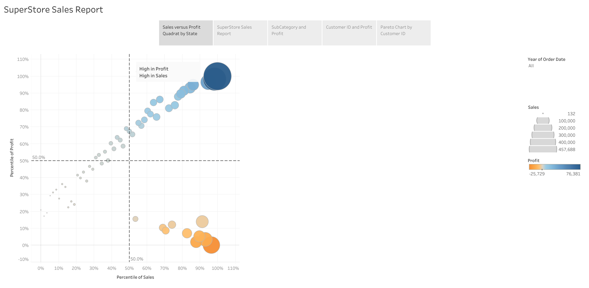
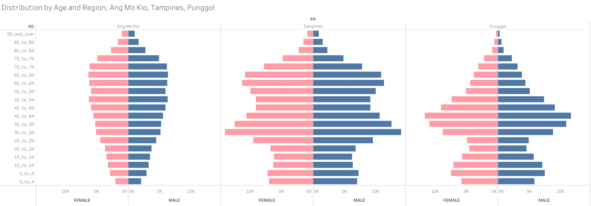

## Overview

In-Class Exercise 3 builds on previous Tableau exercises by creating two separate dashboards using different datasets.

The first dashboard uses the **Superstore dataset** to analyse sales and profit performance across product sub-categories and customers. The second uses **SingStat's June 2025 population data** to visualise the age and gender distribution of Singapore residents across three planning areas.

## Dashboard 1: SuperStore Sales Report

The interactive dashboard can be viewed on Tableau Public at the link below:

👉 [View Dashboard on Tableau Public](https://public.tableau.com/app/profile/carina.peh/viz/InClassExercise3_17777054512350/SuperStoreSalesReport?publish=yes)

This dashboard contains 5 views:

- **Sales versus Profit Quadrant by State** — a bubble scatter plot mapping each state by sales and profit percentile. Bubble size encodes sales volume and colour encodes profit (blue = profitable, orange = loss-making).

- **SuperStore Sales Report** — a general overview of overall sales performance across the dataset.

- **SubCategory and Profit** — a Pareto chart ranking sub-categories by profit, with a cumulative line showing that Copiers, Phones, and Accessories drive the majority of total profit.

- **Customer ID and Profit** — customers ranked by individual profit contribution, with a running cumulative sum and average reference line.

- **Pareto Chart by Customer ID** — The x-axis represents the cumulative percentage of customers, while the y-axis represents the cumulative percentage of total profit. The two dashed reference lines intersect at the 20% customer mark and 80% profit mark, confirming the Pareto principle. The curve rises steeply in the early portion before gradually levelling off, indicating that a small segment of customers generates a disproportionately large share of profit. 

.png)

.png)

.png)

## Dashboard 2: Distribution by Age and Region

The interactive dashboard can be viewed on Tableau Public at the link below:

👉 [View Dashboard on Tableau Public](https://public.tableau.com/app/profile/carina.peh/viz/InClassExercise3bGeographicalDistribution/DistributionbyAgeandRegion?publish=yes)

**Data source:** `respopagesexfa2025.csv` from [SingStat](https://www.singstat.gov.sg/find-data/explore-data-themes/population/geographic-distribution/latest-news-data) — Singapore Residents by Planning Area/Subzone, Age Group, Sex and Floor Area of Residence, June 2025.

The side-by-side population pyramids compare three planning areas:

- **Ang Mo Kio** has a concentration in the middle-to-older age bands (40–74), reflecting a mature, established residential town.
- **Tampines** shows a broad working-age base (30–69), consistent with a large, well-developed HDB estate.
- **Punggol** has a distinctly younger profile — the largest bars sit in the 25–44 range with a strong base of young children, reflecting its newer development attracting young families.

Pink bars represent **Females** and blue bars represent **Males**.

**Pareto Charts** were a key new technique in this exercise. By combining a sorted bar chart with a cumulative percentage line, I could quickly identify which sub-categories and customers drive the most profit. The 80/20 pattern appeared clearly in both the sub-category and customer-level analyses.

**Population Pyramids** required a different approach — splitting the dataset by sex and mirroring bars on opposite sides of a central axis. Comparing three planning areas side-by-side made demographic differences immediately visible, something a table of numbers could not achieve as effectively.

Overall, this exercise reinforced that choosing the right chart type for the right question is more important than technical complexity. Both dashboards answer specific analytical questions clearly and concisely.
