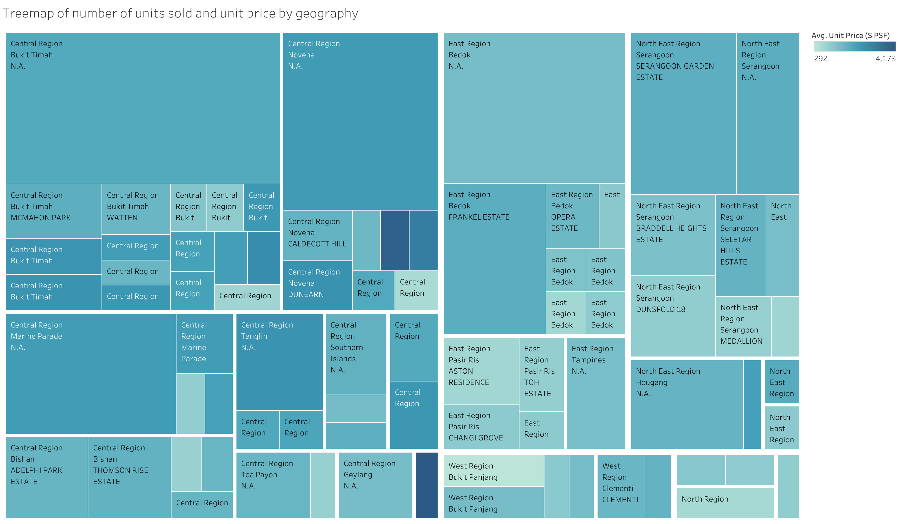
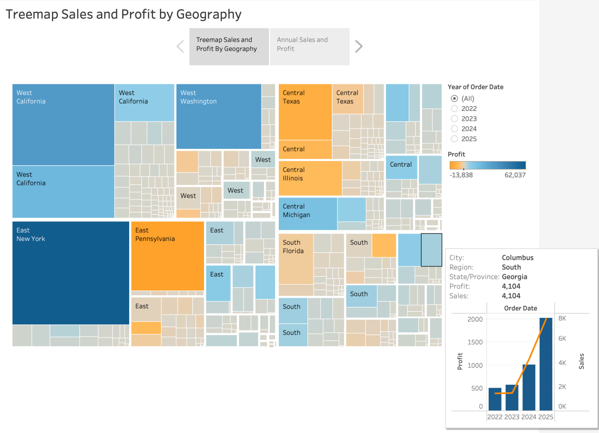

## Overview

These Tableau treemap dashboards used Superstore and Singapore private property datasets. Treemaps display hierarchical data using nested rectangles where the size of each rectangle represents a quantitative value.

## Dashboard 1 — Treemap of Number of Units Sold and Unit Price by Geography

This treemap visualises the distribution of private residential property units sold across Singapore planning regions and areas. The size of each rectangle represents the number of units sold, while the colour intensity shows the average unit price in dollars per square foot.

From this treemap, it is clear that the **Central Region** dominates in terms of total units sold, taking up the largest proportion of the treemap. Within the Central Region, areas like **Bukit Timah** and **Novena** stand out. The colour gradient also reveals that some smaller areas command significantly higher unit prices despite having fewer transactions.

## Dashboard 2 — Treemap Sales and Profit by Geography

This treemap visualises Superstore sales and profit across different US regions and states. The size of each rectangle represents sales volume, while the colour encodes profit, blue indicates positive profit and orange/yellow indicates losses or lower profit.

The dashboard also includes an interactive filter by year (2022–2025) and a tooltip showing detailed city-level profit and sales trends over time. From the treemap, **California** in the West region has the highest sales volume, while some Central states like **Texas** show relatively lower profitability despite sizeable sales.

